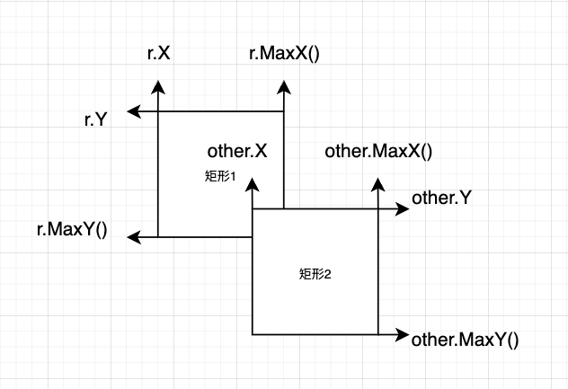

# A simple 2D game practise

## Free assets from [Kenney](https://kenney.nl/assets)

## Free font from [kenney-fonts](https://www.kenney.nl/assets/kenney-fonts)

- [Space Shooter Extension](https://kenney.nl/assets/space-shooter-extension)

## 計算兩個矩形是否有交集 （要計算是否交集, 需滿足四個條件）

- 矩形 1 的左邊緣(X)是否小於等於矩形 2 的右邊緣(MaxX)
- 矩形 1 的右邊緣(MaxX)是否大於等於矩形 2 的左邊緣(X)
- 矩形 1 的上邊緣(Y)是否小於等於矩形 2 的下邊緣(MaxY)
- 矩形 1 的下邊緣(MaxY)是否大於等於矩形 2 的上邊緣(Y)
